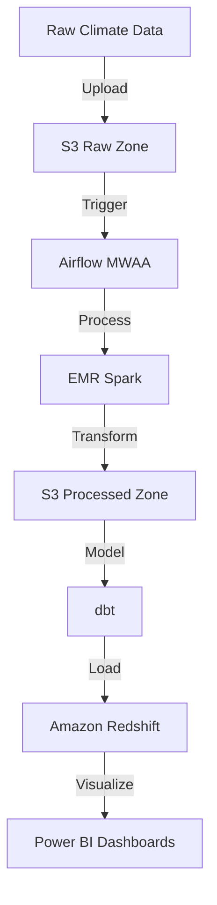

# 🌡️ Sri Lankan Climate Data Pipeline

[](https://www.python.org/)
[](https://airflow.apache.org/)
[](https://spark.apache.org/)
[](https://www.getdbt.com/)
[](https://aws.amazon.com/)
[](LICENSE)

A robust, scalable data pipeline for processing and analyzing Sri Lankan climate data using modern cloud technologies. This project demonstrates best practices in data engineering, including data ingestion, processing, transformation, and visualization.

## 📊 Pipeline Architecture



## 🚀 Features

- **Automated Data Ingestion**: Seamless upload of climate data to AWS S3
- **Scalable Processing**: Distributed data processing using Apache Spark on EMR
- **Workflow Orchestration**: Reliable pipeline orchestration with Apache Airflow
- **Data Transformation**: Clean, tested data models using dbt
- **Data Warehouse**: Efficient storage and querying with Amazon Redshift
- **Visualization**: Interactive dashboards with Power BI
- **Containerized**: Easy deployment using Docker

## 🏗️ Project Structure

```
.
├── airflow/                  # Airflow DAGs and configurations
│   └── dags/
│       └── climate_data_pipeline.py
├── spark/                    # Spark processing jobs
│   └── jobs/
│       └── process_climate_data.py
├── dbt/                      # dbt models and configurations
│   ├── models/
│   └── dbt_project.yml
├── scripts/                  # Utility scripts
│   ├── upload_to_s3.py
│   └── generate_fernet_key.py
├── Dockerfile.upload         # Dockerfile for data upload service
├── Dockerfile.spark         # Dockerfile for Spark processing
├── Dockerfile.dbt           # Dockerfile for dbt service
├── docker-compose.yml       # Docker Compose configuration
└── requirements.txt         # Python dependencies
```

## 🛠️ Setup and Installation

### Prerequisites

- Python 3.8 or higher
- Docker and Docker Compose
- AWS Account with appropriate permissions
- Power BI Desktop (for visualization)

### Quick Start with Docker

1. **Generate Airflow Fernet Key**:
   ```bash
   python scripts/generate_fernet_key.py
   ```

2. **Configure Environment**:
   ```bash
   cp .env.example .env
   # Edit .env with your credentials
   ```

3. **Launch Services**:
   ```bash
   docker-compose up --build
   ```

4. **Access Services**:
   - Airflow UI: http://localhost:8080 (airflow/airflow)
   - Monitor pipeline execution and logs

### Manual Setup

1. **Install Dependencies**:
   ```bash
   pip install -r requirements.txt
   ```

2. **AWS Configuration**:
   ```bash
   aws configure
   # Enter your AWS credentials
   ```

3. **Deploy to AWS**:
   - Deploy Airflow DAG to MWAA
   - Configure EMR cluster
   - Set up Redshift cluster

## ⚙️ Configuration

### Environment Variables

Create a `.env` file with the following variables:

```env
# AWS Configuration
AWS_ACCESS_KEY_ID=your_access_key
AWS_SECRET_ACCESS_KEY=your_secret_key
AWS_REGION=ap-south-1

# S3 Buckets
S3_RAW_BUCKET=climate-raw-data
S3_PROCESSED_BUCKET=climate-processed-data

# Redshift Configuration
REDSHIFT_HOST=your_redshift_endpoint
REDSHIFT_DATABASE=climate_db
REDSHIFT_USER=your_username
REDSHIFT_PASSWORD=your_password

# Airflow Configuration
AIRFLOW__CORE__FERNET_KEY=your_generated_fernet_key
```

## 📈 Usage

### Data Upload

```bash
# Using Docker
docker-compose run data-uploader

# Manual upload
python scripts/upload_to_s3.py
```

### Pipeline Monitoring

1. **Airflow UI**: Monitor DAG execution and logs
2. **EMR Console**: Track Spark job progress
3. **Redshift Console**: Monitor data loading
4. **Power BI**: Create and update dashboards

## 🐳 Docker Services

| Service | Description | Port |
|---------|-------------|------|
| airflow-webserver | Airflow web interface | 8080 |
| airflow-scheduler | Airflow scheduler | - |
| postgres | Airflow metadata database | 5432 |
| data-uploader | S3 upload service | - |
| dbt-runner | dbt execution service | - |

## 🤝 Contributing

1. Fork the repository
2. Create a feature branch
3. Commit your changes
4. Push to the branch
5. Create a Pull Request

## 📝 License

This project is licensed under the MIT License - see the [LICENSE](LICENSE) file for details.
